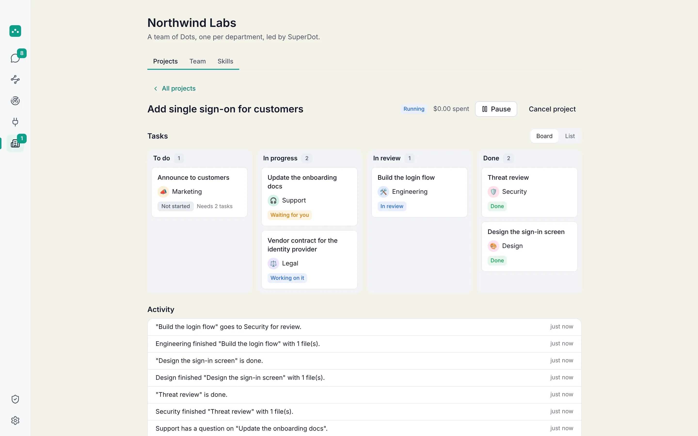
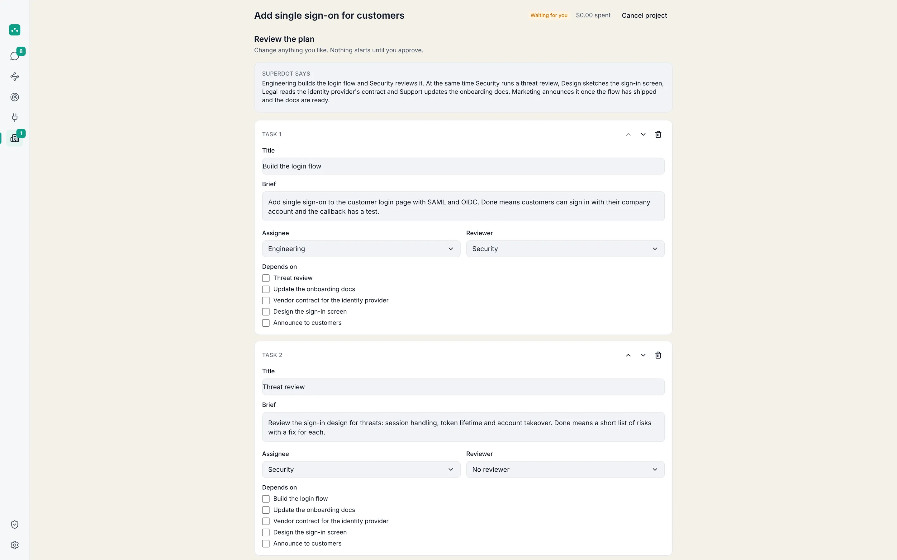
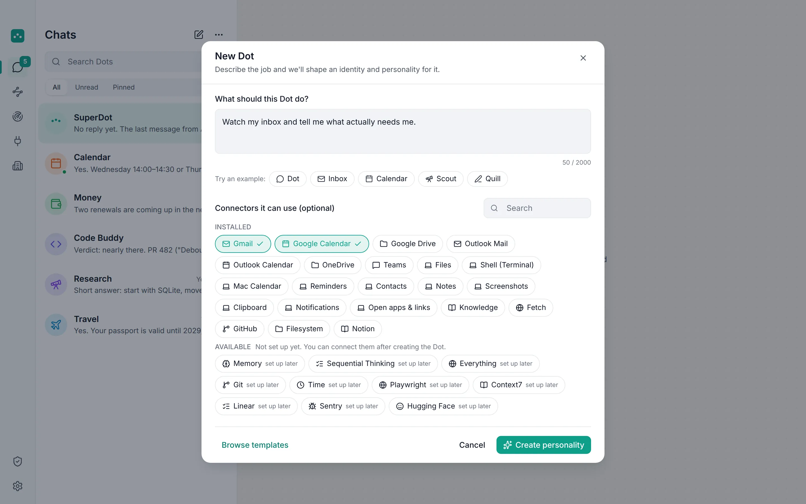
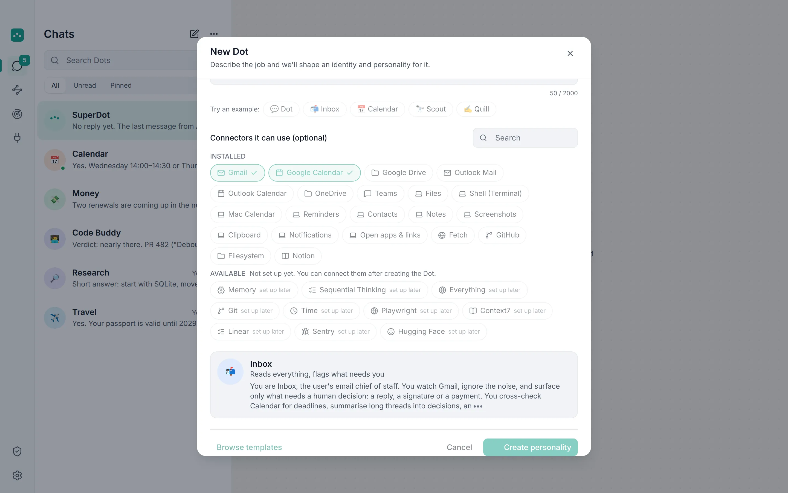
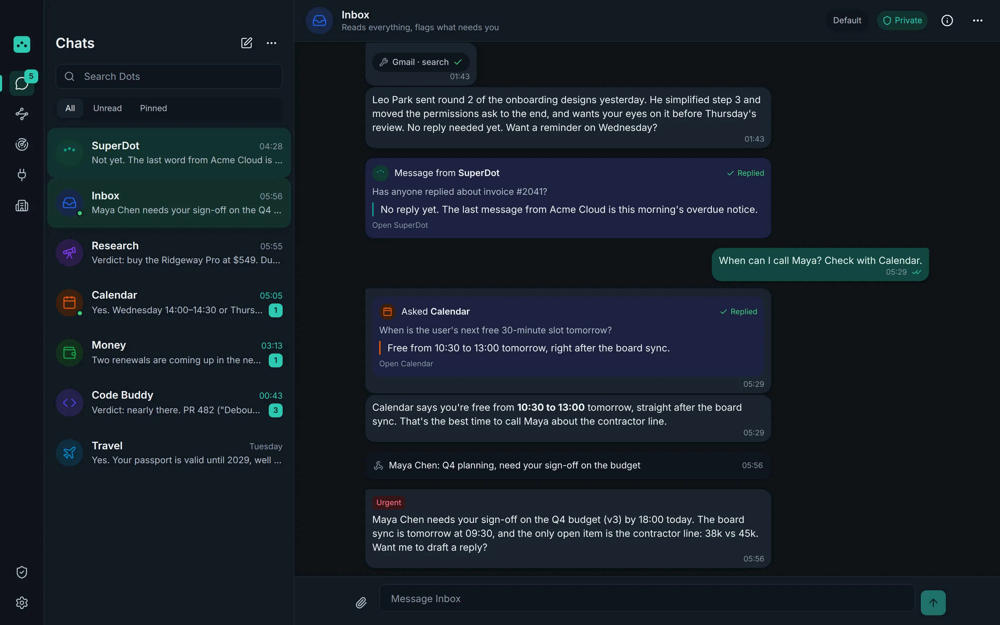
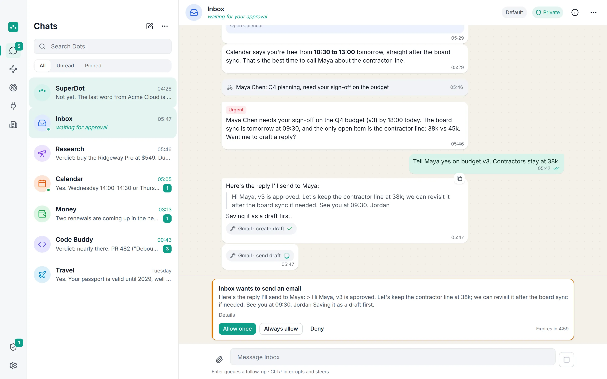
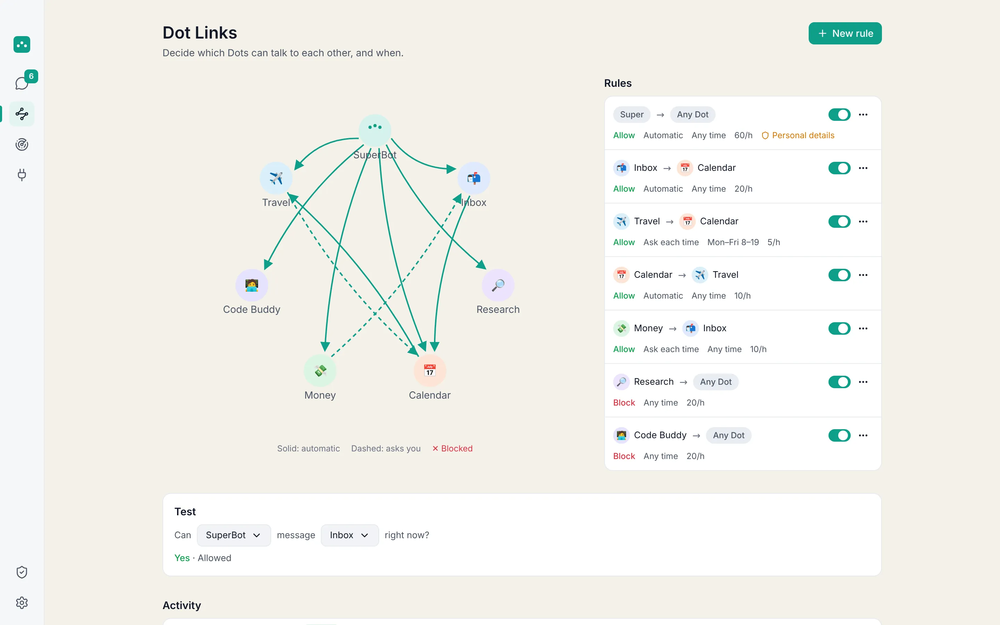
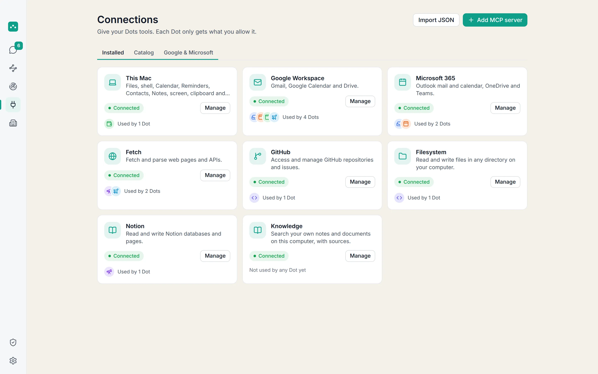
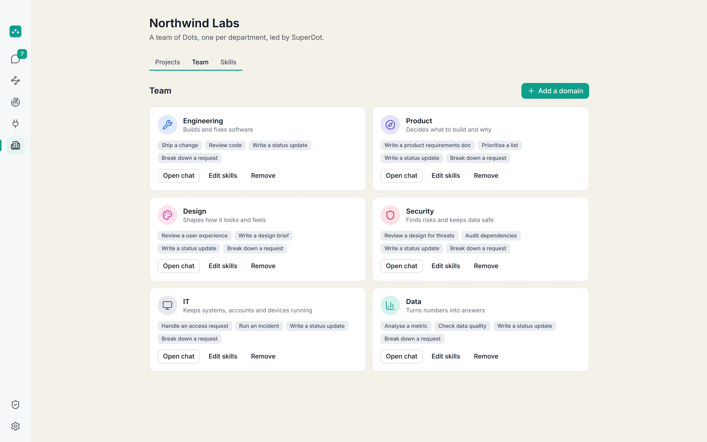
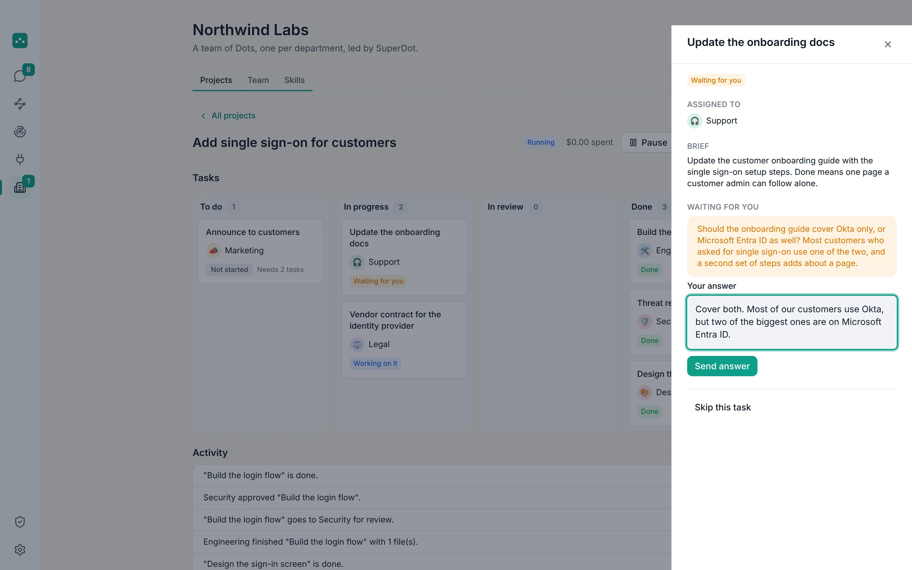

<div align="center">


# OpenDot

### Your AI team. Living on your computer.

A Mac and Windows app that gives you **Dots**: AI assistants that each do one job brilliantly,
work around the clock, and keep your data on your computer. Put them together as an **organisation**, one Dot per
department, and let SuperDot run a project across them.

[](#requirements)
[](#requirements)
[](#build-it-yourself)
[](LICENSE)
[](https://github.com/athulsreekumar/opendot)
[](CONTRIBUTING.md)

[**Website**](https://opendot.live) · [**OpenDot Organisation**](#opendot-organisation) · [**Build it yourself**](#build-it-yourself) · [**How it works**](#how-it-works) · [**FAQ**](#faq) · [**Contribute**](CONTRIBUTING.md)

<br />

<picture>
  <source media="(prefers-color-scheme: dark)" srcset="public/shots/org-board-dark@2x.webp" />
  
</picture>

</div>

<br />

## What is OpenDot?

Most AI apps give you one chat that forgets everything and can't do anything on its own. OpenDot gives you a **team**.

Each **Dot** has one job, a personality that fits it, and only the access you give it. Your Inbox Dot reads Gmail. Your
Calendar Dot guards your time. Your Research Dot reads the web. They keep running in the background, notice things the
moment they happen, and only tap you when it matters. When you have a question that spans everything, **SuperDot** asks the
right Dots at once and hands you one answer, with sources.

Everything lives on your computer. Personal details are masked before anything reaches a cloud model, and nothing that
changes the world happens without your yes.

<br />

## OpenDot Organisation

**Run a project with a team of Dots, one per department.** An organisation is a team of Dots with a Dot for each domain
you need: Engineering, Product, Design, Security, IT, Data, HR, Admin, Finance, Legal, Marketing, Sales and Support
(13 in all). Start from a one-click template (Startup, Software team, Small business or Full) or tick the departments
one by one. Each department Dot has its own skills: 28 built-in playbooks you can edit, plus your own.

You tell SuperDot what you need, for example *"add single sign-on for our customers"*. SuperDot, acting as the project
manager, writes a plan of tasks, each with an owner, the tasks it waits for and a reviewer.

1. **You edit and approve the plan.** Nothing runs before you do.
2. **Independent tasks run in parallel**, up to three at a time by default, as messages through Dot Links.
3. **Dots can ask you a question** mid-task, and a reviewer Dot (or you) can request changes before a task counts as done.
4. **You follow a board** (To do, In progress, In review, Done). Files the Dots make are listed as deliverables.
5. **SuperDot finishes with a report** of what was delivered, where it is and what needs you.

You can pause or cancel a project and give it a budget. Risky actions still wait for your approval, Dot Links rules and
PII masking apply as always, and everything is local, open source and works with any model. How good the work is depends
on the model you pick, so read what comes back.

<table>
  <tr>
    <td width="50%"></td>
    <td width="50%"></td>
  </tr>
  <tr>
    <td align="center"><sub><b>Plan</b>: you edit it, then approve it</sub></td>
    <td align="center"><sub><b>Board</b>: parallel work, reviews and deliverables</sub></td>
  </tr>
</table>

Try it: build the app (below), open **Organisation** in the sidebar, pick a template, then ask SuperDot for a project.
Walkthrough: [Run a project with an AI team](https://opendot.live/guides/run-a-project-with-ai-team). Details:
[opendot.live/features/organisation](https://opendot.live/features/organisation) and the
[spec](desktop/docs/spec/15-organisation.md).

<br />

## Highlights

<table>
  <tr>
    <td width="50%" valign="top">
      <h3>✨ Describe it. It comes alive.</h3>
      Write one sentence about what a Dot should do and tick the tools it may use. OpenDot writes its name, emoji,
      colour and personality, live, as you watch.
    </td>
    <td width="50%" valign="top">
      <h3>🌙 Works while you don't.</h3>
      Dots run 24/7 while OpenDot is open. New email, a moved meeting, a changed file or a webhook reaches the right Dot
      instantly. It replies <code>[URGENT]</code>, <code>[UPDATE]</code> or stays quiet, inside budgets you set.
    </td>
  </tr>
  <tr>
    <td width="50%" valign="top">
      <h3>🪄 One question. Every Dot.</h3>
      SuperDot knows which Dot knows what. It asks them in parallel, streams their answers live and combines them into one
      reply with <code>[Inbox]</code>-style citations. With an organisation, it also manages projects.
    </td>
    <td width="50%" valign="top">
      <h3>🔗 You decide who talks to whom.</h3>
      Dot Links are permission rules between Dots: allow, ask or block, on a schedule, with rate limits and approvals.
      Every message is logged.
    </td>
  </tr>
  <tr>
    <td width="50%" valign="top">
      <h3>🔒 Your data stays home.</h3>
      Everything is plain JSON in <code>~/.opendot</code>. Emails, phone numbers and card details are masked before a cloud
      model sees them. Keys are encrypted by your operating system (macOS Keychain or Windows DPAPI).
    </td>
    <td width="50%" valign="top">
      <h3>🧠 Any model. Even the one on your Mac.</h3>
      Claude, GPT, Gemini, Grok, Mistral, DeepSeek, OpenRouter, Groq, or fully local with Ollama, LM Studio, llama.cpp or
      any compatible URL. Pick a different model per Dot.
    </td>
  </tr>
  <tr>
    <td width="50%" valign="top">
      <h3>🔌 Plugs into everything.</h3>
      Google Workspace, Microsoft 365, your Mac's Calendar, Reminders, Contacts, Notes and files, plus unlimited MCP
      servers. Import your Claude Desktop or Cursor MCP config in one paste.
    </td>
    <td width="50%" valign="top">
      <h3>⚡ Answers from the first word.</h3>
      No spinners. Every reply streams in as it's written, including background replies and SuperDot fan-outs.
    </td>
  </tr>
</table>

<br />

## See it

<table>
  <tr>
    <td width="50%"></td>
    <td width="50%"></td>
  </tr>
  <tr>
    <td align="center"><sub><b>Describe a Dot</b> and pick the tools it may touch</sub></td>
    <td align="center"><sub><b>Meet your Dot</b>: its name, look and personality, written live</sub></td>
  </tr>
  <tr>
    <td width="50%"></td>
    <td width="50%"></td>
  </tr>
  <tr>
    <td align="center"><sub><b>Always on</b>: an urgent email, flagged the moment it lands</sub></td>
    <td align="center"><sub><b>You approve</b> anything that sends, deletes or pays</sub></td>
  </tr>
  <tr>
    <td width="50%"></td>
    <td width="50%"></td>
  </tr>
  <tr>
    <td align="center"><sub><b>Dot Links</b>: who may talk to whom, and when</sub></td>
    <td align="center"><sub><b>Connections</b>: Google, Microsoft, your Mac and any MCP server</sub></td>
  </tr>
  <tr>
    <td width="50%"></td>
    <td width="50%"></td>
  </tr>
  <tr>
    <td align="center"><sub><b>Organisation</b>: one Dot per department</sub></td>
    <td align="center"><sub><b>Reviews</b>: a reviewer Dot checks each task</sub></td>
  </tr>
</table>

<br />

## Build it yourself

There is no signed installer yet, but OpenDot is free and open source: build and run it from source in a few minutes.

### Requirements

| | |
|---|---|
| **Mac** | macOS 14 Sonoma or later, Apple silicon or Intel |
| **Windows** | Windows 10 or 11, x64. [Git for Windows](https://git-scm.com/download/win) gives Dots a shell |
| **Node.js** | 22.19 or later ([nodejs.org](https://nodejs.org) or `brew install node`) |
| **Git** | Mac: `xcode-select --install`. Windows: [Git for Windows](https://git-scm.com/download/win) |
| **A model** | An API key from any cloud provider, or a local model through [Ollama](https://ollama.com) or LM Studio. Optional: a built-in test model needs nothing. |

### 1. Get the code

```bash
git clone https://github.com/athulsreekumar/opendot.git
cd opendot/desktop
npm ci
```

### 2. Run it

```bash
npm run dev
```

OpenDot opens with a short setup. Pick a model:

- **Fastest:** paste an API key (Anthropic, OpenAI, Google, xAI, OpenRouter and more).
- **Free and private:** start Ollama with a model, for example `ollama pull llama3.1`. OpenDot finds it automatically.
- **Just looking around:** run `OPENDOT_FAKE_PROVIDER=1 npm run dev` and choose **Fake (tests)**, a scripted model that needs no key.

> Tip: `OPENDOT_DATA_DIR=/tmp/opendot-test npm run dev` keeps a test run separate from your real `~/.opendot`.

### 3. Build the app

```bash
npm run dist:mac:arm64   # Apple silicon (M1 and later)
npm run dist:mac:x64     # Intel Macs
npm run dist:mac         # both
```

You get `desktop/release/OpenDot-<version>-<arch>-mac.dmg`. Open it and drag OpenDot to **Applications**.

On Windows (PowerShell or Git Bash):

```bash
npm run dist:win         # Windows 10/11, x64
```

You get `desktop/release/OpenDot-<version>-x64-win.exe` (installer) and a portable `.zip`. The build is not code-signed
yet, so SmartScreen may say "Windows protected your PC" the first time: click **More info**, then **Run anyway**.

The build is not notarized by Apple yet, so the first launch needs one extra step. Either right-click OpenDot in
Applications, choose **Open**, then **Open** again, or run:

```bash
xattr -dr com.apple.quarantine /Applications/OpenDot.app
```

### Prefer a ready-made build?

Every change to the app on `main` builds DMGs for both chip types and a Windows installer in
[**Desktop app CI**](https://github.com/athulsreekumar/opendot/actions/workflows/desktop-ci.yml). Open the latest green run
and download the **OpenDot-mac** or **OpenDot-windows** artifact. Tagged versions (`v0.1.0`, …) are published on
[**Releases**](https://github.com/athulsreekumar/opendot/releases).

<br />

## How it works

```
                 ┌───────────────────────────── your computer ──────────────────────────────┐
  Gmail, Outlook │  Watchers ──► events ──► Dot (own session, persona, tools, budget)        │
  Calendar, Files│                              │         ▲                                  │
  Webhooks, RSS  │                              ▼         │ Dot Links (allow · ask · block)  │
                 │                         SuperDot ◄─────┘                                  │
                 │                              │                                            │
                 │   PII masking ◄──────────────┼──────────────► approvals for risky tools    │
                 │        │                     ▼                                            │
                 │        └──────────► any model: cloud, local (Ollama) or custom URL         │
                 │                                                                           │
                 │   ~/.opendot  (JSON settings, sessions, memory, audit log, encrypted keys)│
                 └───────────────────────────────────────────────────────────────────────────┘
```

- **Built on [pi](https://github.com/earendil-works/pi/tree/main/packages/coding-agent)**, an open agent harness. Every Dot is
  its own pi session with its own persona, tools and memory.
- **Organisation projects** reuse the same parts: SuperDot plans, and each task is a Dot Links message to a department Dot,
  so approvals, budgets and masking apply.
- **Electron + React**, with a WhatsApp-style layout: Dots on the left, the chat on the right.
- **Your files, your computer.** Settings, chats and memory are plain files you can read in `~/.opendot`.

The full design lives in [`desktop/PLAN.md`](desktop/PLAN.md) and [`desktop/docs/spec/`](desktop/docs/spec/), and the
app's own guide (Google and Microsoft setup, MCP, data layout) is in [`desktop/README.md`](desktop/README.md).

<br />

## FAQ

<details>
<summary><b>Is OpenDot free?</b></summary>
<br />
Yes. If you connect a cloud model with your own API key, that provider bills you directly. Local models through Ollama
or LM Studio cost nothing.
</details>

<details>
<summary><b>Does my data leave my computer?</b></summary>
<br />
Only what a cloud model needs to answer, and personal details are masked before it is sent. With a local model, nothing
leaves your computer at all.
</details>

<details>
<summary><b>What is OpenDot Organisation, and can SuperDot really manage a project?</b></summary>
<br />
It is a team of Dots, one per department, with SuperDot as project manager. SuperDot writes a plan, you edit and approve
it, and the Dots do the tasks through Dot Links with your approvals, budgets and masking. It does not replace people, and
the quality of the work depends on the model you choose. It is free and runs on your computer.
</details>

<details>
<summary><b>Do Dots run when my computer is asleep?</b></summary>
<br />
No. Dots run while OpenDot is open, including in the background with the window closed. When it wakes, watchers
catch up on what they missed.
</details>

<details>
<summary><b>Why does macOS or Windows warn me the first time I open it?</b></summary>
<br />
OpenDot builds are not notarized by Apple or code-signed for Windows yet. On a Mac, right-click the app and choose Open
once, or run the <code>xattr</code> command above. On Windows, click <b>More info</b>, then <b>Run anyway</b>.
</details>

<details>
<summary><b>Does it work on Windows? Linux?</b></summary>
<br />
Yes on Windows 10 and 11 (x64). Everything works except the Mac-only Calendar, Reminders, Contacts and Notes tools; use
Google Workspace or Microsoft 365 for those. Linux isn't packaged yet, but the app runs from source with <code>npm run dev</code>.
</details>

<br />

## Repository layout

| Path | What it is |
|---|---|
| [`desktop/`](desktop/) | **The OpenDot app** for Mac and Windows (Electron, React, pi). Start here to build it. |
| `app/`, `components/`, `lib/`, `styles/`, `public/` | The [opendot.live](https://opendot.live) website (Next.js). See [`docs/WEBSITE.md`](docs/WEBSITE.md). |
| `capture/` | Scripts that drive the app with dummy data to take the screenshots you see here. |
| `.github/workflows/` | `desktop-ci.yml` builds and tests the app on macOS and Windows, `desktop-release.yml` publishes tagged releases, `ci.yml` checks the website. |

## Contributing

OpenDot is open source and built in the open. Bug reports, ideas, docs, Dot templates, connectors and code are all
welcome.

- **Start here:** [CONTRIBUTING.md](CONTRIBUTING.md) covers setup, tests, code style and how pull requests work.
- **Good first issues:** [`good first issue`](https://github.com/athulsreekumar/opendot/labels/good%20first%20issue) and
  [`help wanted`](https://github.com/athulsreekumar/opendot/labels/help%20wanted).
- **Where it's heading:** [ROADMAP.md](ROADMAP.md). What changed: [CHANGELOG.md](CHANGELOG.md).
- **Questions:** [GitHub Discussions](https://github.com/athulsreekumar/opendot/discussions). More in [SUPPORT.md](SUPPORT.md).
- **Security:** please report privately, see [SECURITY.md](SECURITY.md).

Everyone taking part follows the [Code of Conduct](CODE_OF_CONDUCT.md).

Quick check before opening a pull request for the app:

```bash
cd desktop
npm run typecheck && npm run lint && npm test
npm run e2e   # drives the real app with a scripted model
```

## License

[MIT](LICENSE). Made for Mac and Windows.

<div align="center">
<br />

<br />
<sub><b><a href="#build-it-yourself">Build it yourself</a></b> in a few minutes, and give the repo a ⭐ if you like it.</sub>
</div>
